# Bluetooth Plugin - Architecture Diagrams

> **Note**: These Mermaid diagrams visualize the architecture patterns, dependencies, and flows in the Bluetooth Plugin solution. View this file in GitHub, GitLab, VS Code with Mermaid preview, or any Mermaid-compatible markdown viewer.

---

## 📦 Project Dependency Structure

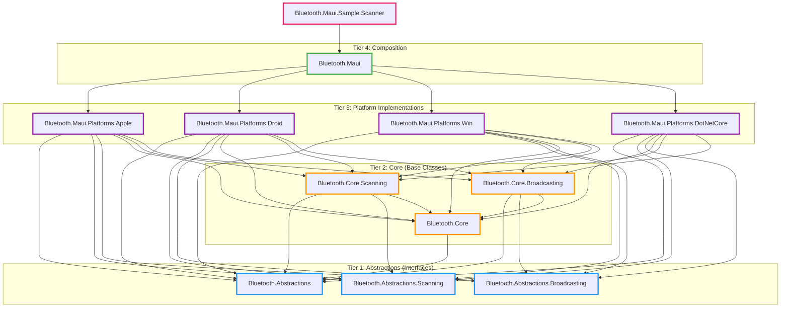

---

## 🏛️ Three-Tier Entity Pattern (Scanner Example)

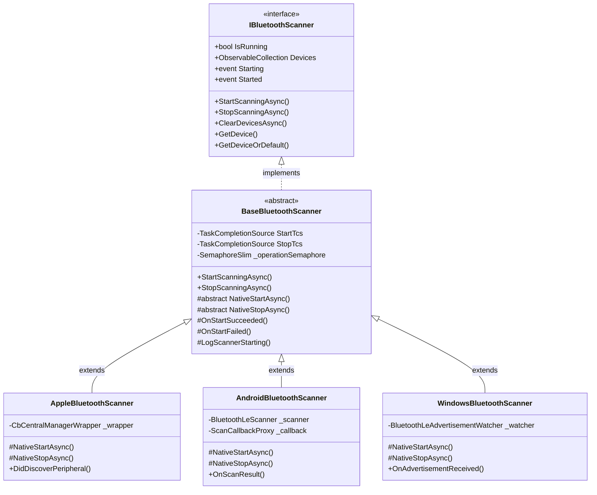

---

## 🏭 Factory Pattern with Nested Request Records

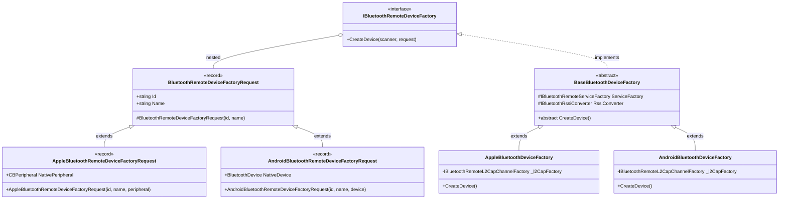

---

## 🔄 TaskCompletionSource (TCS) Async Coordination Flow

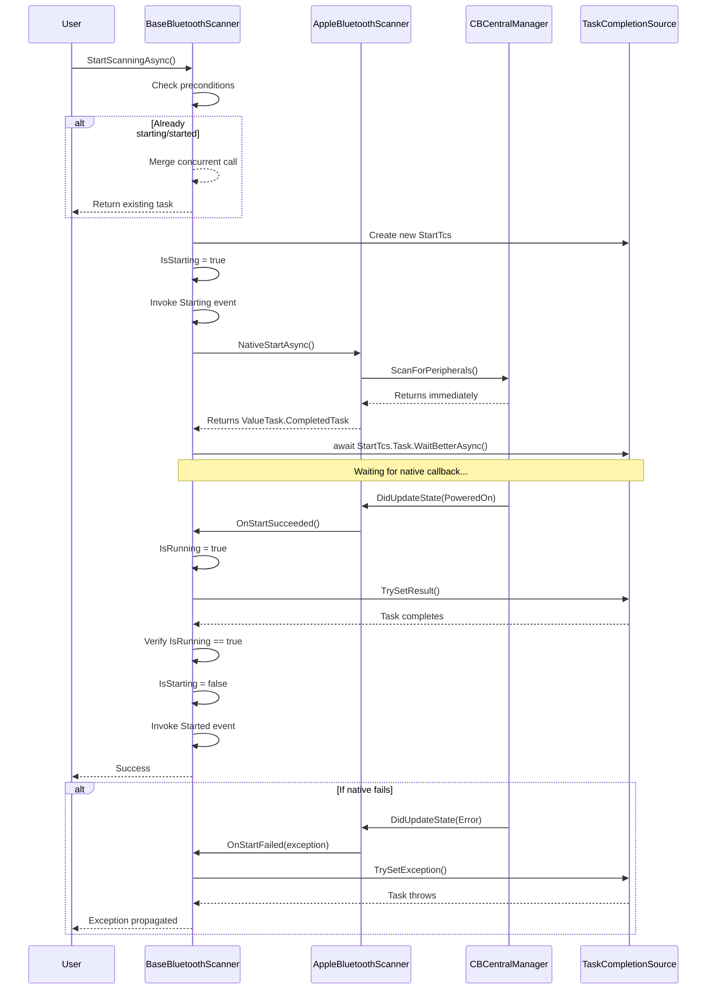

---

## 🧬 Complete Entity Inheritance Hierarchy

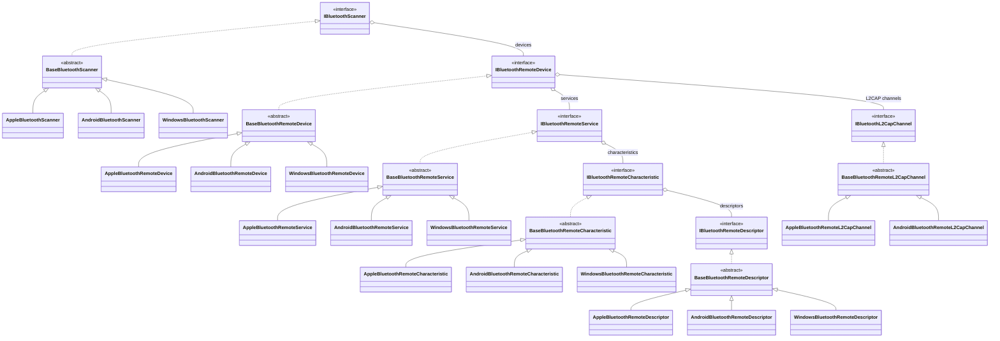

---

## 🔗 Scanner-to-Device-to-Service-to-Characteristic Flow

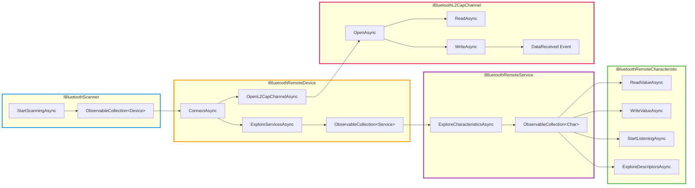

---

## 🏗️ Dependency Injection Hierarchy

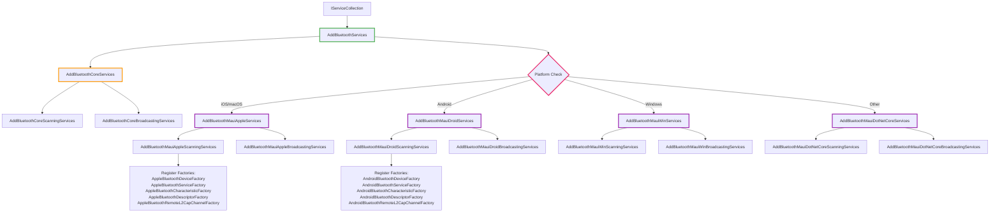

---

## 🎯 Factory Creation Flow (Device Example)

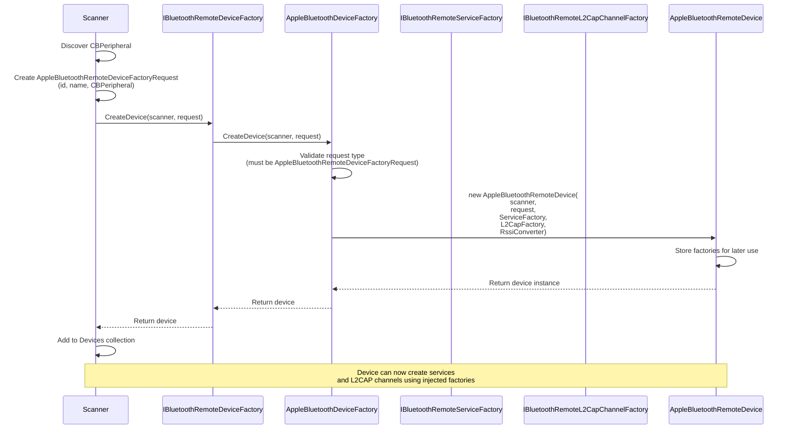

---

## 🧱 Native Wrapper Pattern (Apple Example)

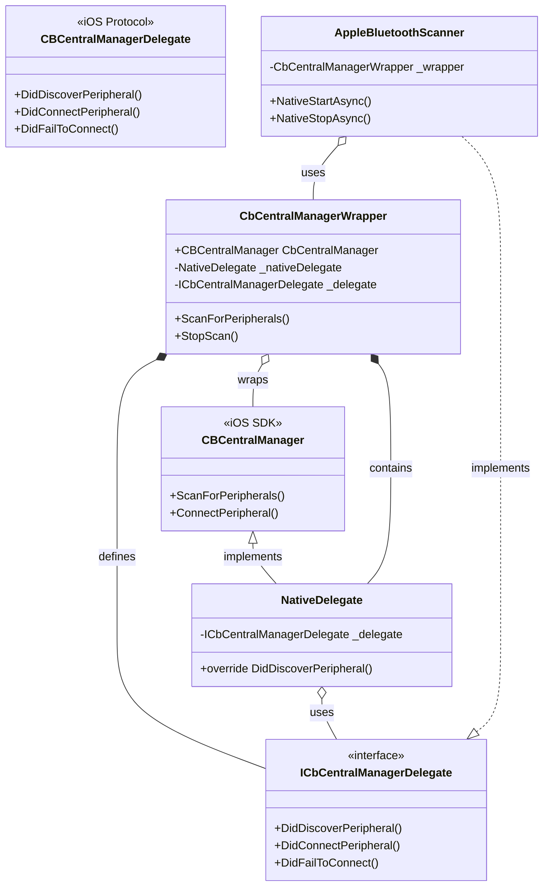

---

## 📊 Exception Hierarchy

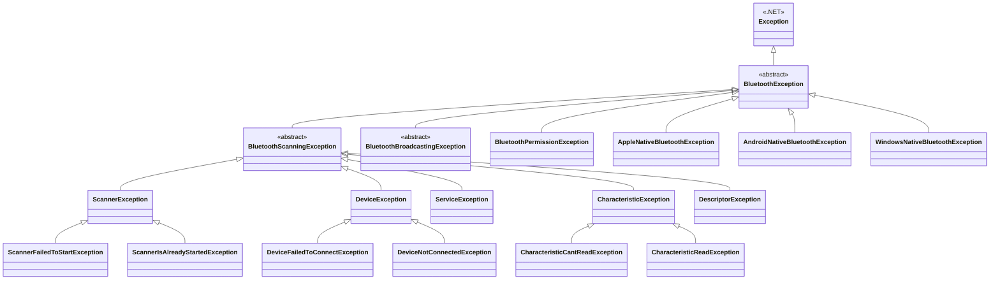

---

## 🔍 Partial Class File Organization

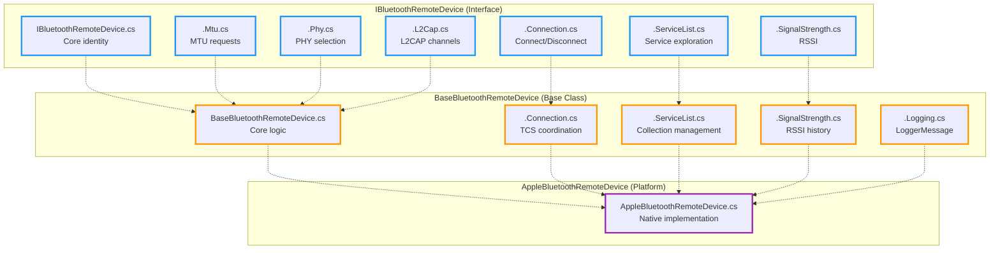

---

## 📈 Logging Architecture

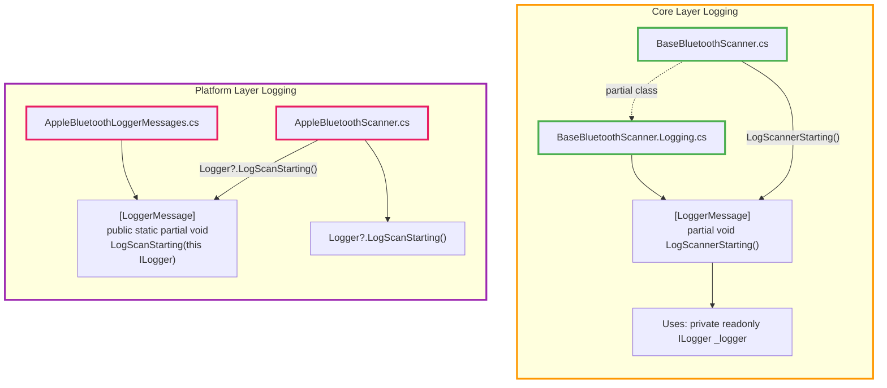

---

## 🎨 Key Architectural Concepts Summary

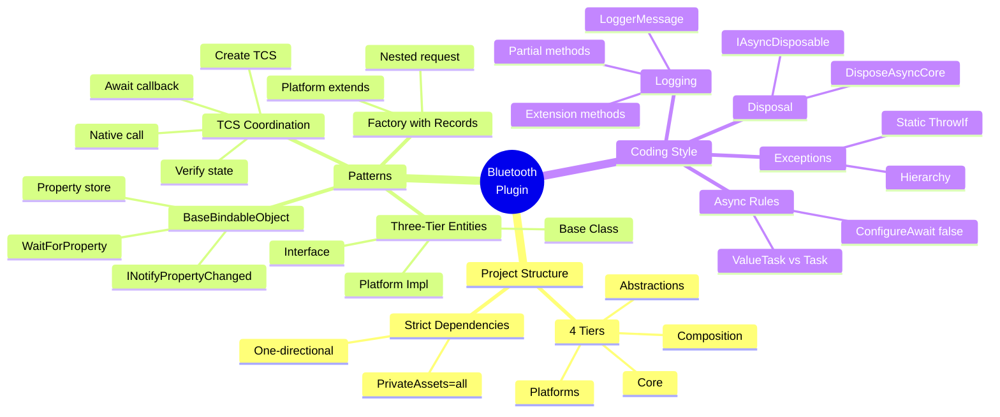

---

**Generated:** 2026-02-24
**View in:** GitHub, VS Code (Markdown Preview Mermaid Support), or any Mermaid-compatible viewer
