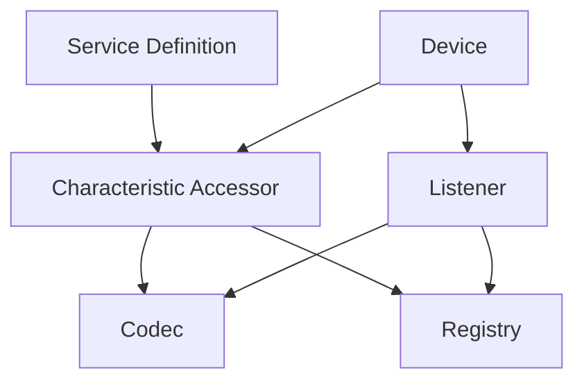

# Service Definitions and Profiles

## Overview

The **Service Definitions and Profiles** system provides a typed, strongly-defined way to work with known Bluetooth services and characteristics. Instead of manually discovering services and characteristics by UUID every time, you can define reusable service profiles with typed accessors that handle encoding/decoding automatically.

**Key Benefits:**

- **Type Safety**: Read/write operations use strongly-typed values instead of raw byte arrays
- **Reusability**: Define once, use everywhere
- **Name Resolution**: Automatic service and characteristic name lookup for diagnostics
- **AOT-Friendly**: Explicit registration replaces reflection-based discovery
- **Separation of Concerns**: Codec logic separated from characteristic resolution
- **Testability**: Mock accessors and listeners independently

## Architecture

The profiles system consists of these core components:



### Core Components

| Component | Purpose | Location |
| --------- | ------- | -------- |
| `IBluetoothServiceDefinitionRegistry` | Stores service/characteristic definitions | `Bluetooth.Abstractions.Scanning.Profiles` |
| `IBluetoothCharacteristicAccessor<TRead, TWrite>` | Typed read/write operations | `Bluetooth.Abstractions.Scanning.Profiles` |
| `IBluetoothCharacteristicAccessorListener<TRead>` | Typed notification listeners | `Bluetooth.Abstractions.Scanning.Profiles` |
| `ICharacteristicCodec<TRead, TWrite>` | Encode/decode logic | `Bluetooth.Abstractions.Scanning.Profiles` |
| `BluetoothServiceDefinitionRegistrar` | Registers static service definitions | `Bluetooth.Core.Scanning.Profiles` |
| `CharacteristicAccessor<TRead, TWrite>` | Implementation of typed accessor | `Bluetooth.Core.Scanning.Profiles` |
| `CharacteristicAccessorListener<TRead>` | Implementation of typed listener | `Bluetooth.Core.Scanning.Profiles` |

## Service Definitions

A **service definition** is a static class that declares:

- Service name and UUID
- Typed characteristic accessors
- Optional codec customization

### Defining a Service

```csharp
[BluetoothServiceDefinition]
public static class BatteryServiceDefinition
{
    /// <summary>
    ///     Gets the Battery Service display name.
    /// </summary>
    public static readonly string Name = "Battery Service";

    /// <summary>
    ///     Gets the Battery Service UUID (0x180F).
    /// </summary>
    public static readonly Guid Id = BluetoothServiceDefinitions.FromShortId(0x180F);

    /// <summary>
    ///     Gets an accessor for the Battery Level characteristic.
    /// </summary>
    public static readonly IBluetoothCharacteristicAccessor<byte, byte> BatteryLevel =
        BluetoothServiceDefinitions.ByteCharacteristic(Id, 0x2A19, Name, "Battery Level");
}
```

**Requirements:**

- Must be a static class
- Must have `[BluetoothServiceDefinition]` attribute
- Must expose public static `Id` (Guid) and `Name` (string) members
- Characteristic accessors should be public static fields or properties

### Built-in SIG Service Definitions

The library includes Bluetooth SIG standard service definitions with links to official specifications:

| Service | UUID | Namespace | Key Characteristics |
| ------- | ---- | --------- | ------------------- |
| Battery Service | 0x180F | `BluetoothSig.BatteryServiceDefinition` | BatteryLevel |
| Device Information Service | 0x180A | `BluetoothSig.DeviceInformationServiceDefinition` | ManufacturerName, ModelNumber, SerialNumber, HardwareRevision, FirmwareRevision, SoftwareRevision, SystemId, RegulatoryCertificationDataList, PnpId |
| Generic Access Service | 0x1800 | `BluetoothSig.GenericAccessServiceDefinition` | DeviceName, Appearance, PeripheralPreferredConnectionParameters |
| Generic Attribute Service | 0x1801 | `BluetoothSig.GenericAttributeServiceDefinition` | ServiceChanged |
| Heart Rate Service | 0x180D | `BluetoothSig.HeartRateServiceDefinition` | HeartRateMeasurement, BodySensorLocation, HeartRateControlPoint |
| Health Thermometer Service | 0x1809 | `BluetoothSig.HealthThermometerServiceDefinition` | TemperatureMeasurement, TemperatureType, IntermediateTemperature, MeasurementInterval |
| Environmental Sensing Service | 0x181A | `BluetoothSig.EnvironmentalSensingServiceDefinition` | Temperature, Humidity, Pressure, UvIndex |

All service definitions include:

- **Official specification links** in XML documentation
- **Bluetooth SIG assigned UUIDs** and service IDs
- **Detailed characteristic descriptions** with data formats
- **Links to YAML assigned numbers repository**

Located in: `Bluetooth.Core.Scanning.Profiles.BluetoothSig`

**Official Resources:**

- [Bluetooth SIG Assigned Numbers](https://www.bluetooth.com/specifications/assigned-numbers/)
- [Service UUID YAML](https://bitbucket.org/bluetooth-SIG/public/src/main/assigned_numbers/uuids/service_uuids.yaml)
- [Characteristic UUID YAML](https://bitbucket.org/bluetooth-SIG/public/src/main/assigned_numbers/uuids/characteristic_uuids.yaml)
- [Service Specifications](https://www.bluetooth.com/specifications/specs/)

## Characteristic Accessors

A **characteristic accessor** provides typed read/write operations for a specific characteristic.

### Accessor Interface

```csharp
public interface IBluetoothCharacteristicAccessor<TRead, in TWrite>
{
    Guid ServiceId { get; }
    Guid CharacteristicId { get; }
    string ServiceName { get; }
    string CharacteristicName { get; }

    ValueTask<IBluetoothRemoteCharacteristic> ResolveCharacteristicAsync(
        IBluetoothRemoteDevice device,
        TimeSpan? timeout = null,
        CancellationToken cancellationToken = default);

    bool CanRead(IBluetoothRemoteDevice device);
    bool CanWrite(IBluetoothRemoteDevice device);
    bool CanListen(IBluetoothRemoteDevice device);

    ValueTask<TRead> ReadAsync(
        IBluetoothRemoteDevice device,
        bool skipIfPreviouslyRead = false,
        TimeSpan? timeout = null,
        CancellationToken cancellationToken = default);

    ValueTask WriteAsync(
        IBluetoothRemoteDevice device,
        TWrite value,
        bool skipIfOldValueMatchesNewValue = false,
        TimeSpan? timeout = null,
        CancellationToken cancellationToken = default);
}
```

### Creating Accessors

Use `BluetoothServiceDefinitions` factory helpers:

```csharp
// Byte characteristic
var batteryLevel = BluetoothServiceDefinitions.ByteCharacteristic(
    serviceId, 0x2A19, "Battery Service", "Battery Level");

// String characteristic
var deviceName = BluetoothServiceDefinitions.StringCharacteristic(
    serviceId, 0x2A00, "Generic Access", "Device Name");

// Version characteristic
var firmwareVersion = BluetoothServiceDefinitions.VersionCharacteristic(
    serviceId, 0x2A26, "Device Information", "Firmware Revision");

// Raw bytes characteristic
var customData = BluetoothServiceDefinitions.BytesCharacteristic(
    serviceId, 0x1234, "Custom Service", "Custom Data");

// Custom typed characteristic
var customAccessor = BluetoothServiceDefinitions.Characteristic<MyReadType, MyWriteType>(
    serviceId,
    0x1234,
    myCustomCodec,
    "Custom Service",
    "Custom Characteristic");
```

### Using Accessors

```csharp
// Connect to device
await device.ConnectAsync();

// Read typed value
var batteryLevel = await BatteryServiceDefinition.BatteryLevel.ReadAsync(device);
Console.WriteLine($"Battery: {batteryLevel}%");

// Check capability first
if (BatteryServiceDefinition.BatteryLevel.CanRead(device))
{
    var level = await BatteryServiceDefinition.BatteryLevel.ReadAsync(device);
}

// Write typed value
await myAccessor.WriteAsync(device, newValue);

// Resilient read with default fallback
var level = await BatteryServiceDefinition.BatteryLevel.ReadOrDefaultAsync(device, defaultValue: 0);
```

## Characteristic Codecs

A **codec** handles encoding values to bytes (for writes) and decoding bytes to values (for reads).

### Interface

```csharp
public interface ICharacteristicCodec<TRead, in TWrite>
{
    TRead FromBytes(ReadOnlyMemory<byte> bytes);
    ReadOnlyMemory<byte> ToBytes(TWrite value);
}
```

### Built-in Codecs

Use `CharacteristicCodecFactory`:

```csharp
// Byte codec (single byte)
var byteCodec = CharacteristicCodecFactory.ForByte();

// Bytes codec (raw byte array)
var bytesCodec = CharacteristicCodecFactory.ForBytes();

// String codec (UTF-8 encoded)
var stringCodec = CharacteristicCodecFactory.ForString();

// Version codec (parses version strings)
var versionCodec = CharacteristicCodecFactory.ForVersion();
```

### Custom Codecs

```csharp
public class TemperatureCodec : ICharacteristicCodec<float, float>
{
    public float FromBytes(ReadOnlyMemory<byte> bytes)
    {
        if (bytes.Length != 2)
            throw new CharacteristicCodecException(typeof(float), bytes, "Expected 2 bytes");

        // Temperature in 0.01°C units (little-endian)
        var rawValue = BinaryPrimitives.ReadInt16LittleEndian(bytes.Span);
        return rawValue / 100.0f;
    }

    public ReadOnlyMemory<byte> ToBytes(float value)
    {
        var rawValue = (short)(value * 100);
        var buffer = new byte[2];
        BinaryPrimitives.WriteInt16LittleEndian(buffer, rawValue);
        return buffer;
    }
}
```

## Characteristic Listeners

A **listener** coordinates typed notification/indication callbacks for a characteristic.

### Creating Listeners

```csharp
var listener = new CharacteristicAccessorListener<byte>(
    serviceId: Guid.Parse("0000180F-0000-1000-8000-00805F9B34FB"),
    characteristicId: Guid.Parse("00002A19-0000-1000-8000-00805F9B34FB"),
    codec: CharacteristicCodecFactory.ForByte(),
    serviceName: "Battery Service",
    characteristicName: "Battery Level");
```

### Subscribing to Notifications

```csharp
// Subscribe to notifications
await listener.SubscribeAsync(device, value =>
{
    Console.WriteLine($"Battery level changed: {value}%");
});

// Multiple subscribers
await listener.SubscribeAsync(device, OnBatteryLevelChanged1);
await listener.SubscribeAsync(device, OnBatteryLevelChanged2);

// Unsubscribe specific listener
await listener.UnsubscribeAsync(device, OnBatteryLevelChanged1);

// Unsubscribe all listeners
await listener.UnsubscribeAllAsync(device);

// Cleanup
await listener.DisposeAsync();
```

**Important Differences from Raw Characteristics:**

- Listeners are **fan-out callbacks**, not bool-return handlers
- Notification payloads are **decoded from event args**, not characteristic cache state
- Start/stop listening is **tied to first/last subscriber**
- Automatic cleanup on dispose

## Service Definition Registry

The **registry** stores service and characteristic definitions for name resolution.

### Registration

Register service definitions during DI setup:

```csharp
// Register built-in SIG profiles
builder.Services.AddBluetoothSigProfiles();

// Register custom service definition
builder.Services.AddSingleton<BluetoothServiceDefinitionRegistration>(_ => registry =>
{
    BluetoothServiceDefinitionRegistrar.Register(registry, typeof(MyServiceDefinition));
});
```

If you use `AddBluetoothServices()` from `Bluetooth.Maui`, SIG profiles are included automatically.

### Name Resolution

The registry provides name lookup:

```csharp
// Get service name by UUID
string? serviceName = registry.GetServiceName(serviceUuid);

// Get characteristic name by service + characteristic UUID (preferred)
string? charName = registry.GetCharacteristicName(serviceUuid, characteristicUuid);

// Get characteristic name by characteristic UUID only (if unambiguous)
string? charName = registry.GetCharacteristicName(characteristicUuid);
```

**Note:** Always prefer the `(serviceId, characteristicId)` lookup to avoid ambiguity when the same characteristic UUID appears in multiple services.

## Extension Methods

### Resilient Read Operations

The `CharacteristicAccessorExtensions` class provides resilient read methods:

```csharp
// Read with default fallback
var level = await accessor.ReadOrDefaultAsync(
    device,
    defaultValue: 0,
    skipIfPreviouslyRead: false);

// Also available as ReadValueOrDefaultAsync
var level = await accessor.ReadValueOrDefaultAsync(device, defaultValue: 0);
```

These methods return the default value when:

- The service/characteristic cannot be resolved
- The characteristic does not support reading

**Exception Behavior:**

- Resolution failures → returns default value
- Codec/decode failures → propagates exception (to avoid masking data corruption)

## Complete Example

### Define a Custom Service

```csharp
[BluetoothServiceDefinition]
public static class EnvironmentalSensingServiceDefinition
{
    public static readonly string Name = "Environmental Sensing";
    public static readonly Guid Id = BluetoothServiceDefinitions.FromShortId(0x181A);

    // Temperature characteristic (0x2A6E)
    public static readonly IBluetoothCharacteristicAccessor<float, float> Temperature =
        BluetoothServiceDefinitions.Characteristic<float, float>(
            Id,
            0x2A6E,
            new TemperatureCodec(),
            Name,
            "Temperature");

    // Humidity characteristic (0x2A6F)
    public static readonly IBluetoothCharacteristicAccessor<ushort, ushort> Humidity =
        BluetoothServiceDefinitions.Characteristic<ushort, ushort>(
            Id,
            0x2A6F,
            new HumidityCodec(),
            Name,
            "Humidity");
}
```

### Register the Service

```csharp
// In your DI configuration
builder.Services.AddSingleton<BluetoothServiceDefinitionRegistration>(_ => registry =>
{
    BluetoothServiceDefinitionRegistrar.Register(
        registry,
        typeof(EnvironmentalSensingServiceDefinition));
});
```

### Use the Service

```csharp
// Connect and read
await device.ConnectAsync();

var temperature = await EnvironmentalSensingServiceDefinition.Temperature.ReadAsync(device);
Console.WriteLine($"Temperature: {temperature:F1}°C");

var humidity = await EnvironmentalSensingServiceDefinition.Humidity.ReadAsync(device);
Console.WriteLine($"Humidity: {humidity / 100.0:F1}%");

// Listen for temperature changes
var temperatureListener = new CharacteristicAccessorListener<float>(
    EnvironmentalSensingServiceDefinition.Id,
    EnvironmentalSensingServiceDefinition.Temperature.CharacteristicId,
    new TemperatureCodec(),
    "Environmental Sensing",
    "Temperature");

await temperatureListener.SubscribeAsync(device, temp =>
{
    Console.WriteLine($"Temperature changed: {temp:F1}°C");
});
```

## Migration from Archived Model

If you're migrating from the archived characteristic access model, see the [Profile Migration](../Configuration/Profile-Migration.md) guide.

**Key Changes:**

- `CharacteristicAccessService<T>` → `IBluetoothCharacteristicAccessor<TRead, TWrite>`
- `CharacteristicAccessServiceFactory` → `CharacteristicCodecFactory` + `CharacteristicAccessor<TRead, TWrite>`
- `[ServiceDefinition]` auto-discovery → Explicit `BluetoothServiceDefinitionRegistrarDelegate`
- UUID-only lookup → `(serviceId, characteristicId)` pair lookup
- Callback registration → `IBluetoothCharacteristicAccessorListener<TRead>`

## Best Practices

1. **Define Services Once**: Create service definition classes for all services you use
2. **Use Typed Accessors**: Prefer typed accessors over raw byte operations
3. **Register at Startup**: Register all service definitions during DI configuration
4. **Pair-Key Lookups**: Always use `(serviceId, characteristicId)` for name resolution
5. **Resilient Reads**: Use `ReadOrDefaultAsync` for optional characteristics
6. **Dispose Listeners**: Always dispose listeners to prevent memory leaks
7. **Custom Codecs**: Create reusable codecs for complex data formats
8. **Error Handling**: Catch `CharacteristicAccessorResolutionException` and `CharacteristicCodecException`

## Related Documentation

- [Characteristic](Characteristic.md) - Low-level characteristic operations
- [Service](Service.md) - Service exploration and management
- [Profile Migration](../Configuration/Profile-Migration.md) - Migrating from archived model
- [Dependency Injection](../Configuration/Dependency-Injection.md) - DI setup

## See Also

- `Bluetooth.Abstractions.Scanning.Profiles` namespace - Core interfaces
- `Bluetooth.Core.Scanning.Profiles` namespace - Implementation
- `Bluetooth.Core.Scanning.Profiles.BluetoothSig` namespace - SIG service definitions
