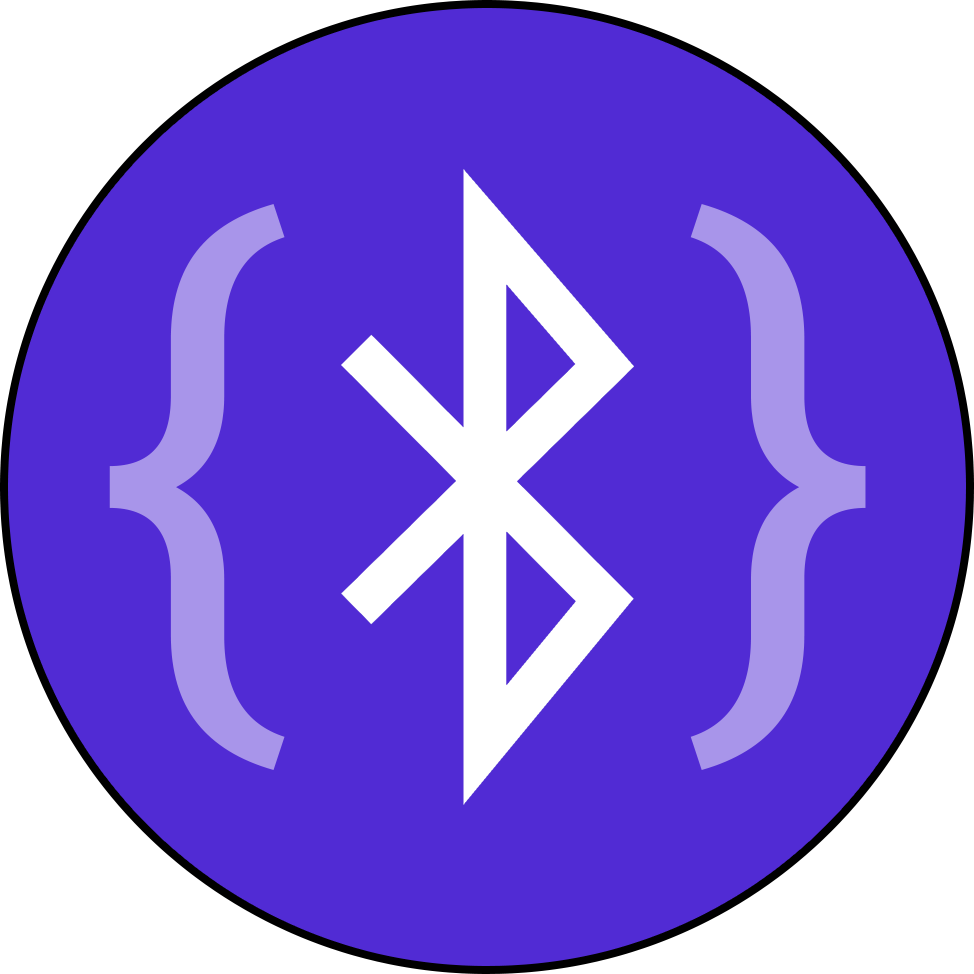

# Bluetooth.Core & Bluetooth.Maui

<div style="max-width: 256px; margin-left: auto; margin-right: auto;">

[](https://github.com/laerdal/Plugin.Bluetooth)

</div>

[](https://github.com/laerdal/Plugin.Bluetooth/actions/workflows/ci.yml)
[](https://dotnet.microsoft.com/)
[](https://www.nuget.org/packages/Bluetooth.Maui)
[](https://www.nuget.org/packages/Bluetooth.Maui)
[](https://github.com/laerdal/Plugin.Bluetooth/releases)
[](LICENSE.md)

A cross-platform .NET MAUI Bluetooth Low Energy (BLE) library providing a unified API for Android, iOS, and Windows platforms.

## Features

- 🔍 **Bluetooth Scanning** - Discover nearby BLE devices with filtering
- 🔗 **Device Connection** - Connect and manage multiple devices
- 📡 **GATT Operations** - Read, write, and subscribe to characteristics
- 📢 **Broadcasting** - Act as a BLE peripheral (Android only)
- 🎯 **Cross-Platform** - Consistent API across Android, iOS, and Windows
- 🔄 **Async/Await** - Modern async patterns with cancellation support
- 💉 **Dependency Injection** - Built-in MAUI DI support

## Installation

```bash
dotnet add package Bluetooth.Maui
```

## Quick Start

### Option 1: MAUI Dependency Injection (Recommended)

Register Bluetooth services in your `MauiProgram.cs`:

```csharp
public static class MauiProgram
{
    public static MauiApp CreateMauiApp()
    {
        var builder = MauiApp.CreateBuilder();

        builder
            .UseMauiApp<App>()
            .UseBluetooth(
                configureScanner: scanner =>
                {
                    // Optional: Configure scanner
                    scanner.AdvertisementFilter = ad => ad.IsConnectable;
                }
            );

        return builder.Build();
    }
}
```

Then inject `IBluetoothScanner` in your pages or view models:

```csharp
public partial class MainPage : ContentPage
{
    private readonly IBluetoothScanner _scanner;

    public MainPage(IBluetoothScanner scanner)
    {
        InitializeComponent();
        _scanner = scanner;
    }

    protected override async void OnAppearing()
    {
        base.OnAppearing();

        // Explicitly initialize when ready (handles permissions)
        await _scanner.InitializeAsync();

        // Start scanning
        await _scanner.StartAsync();
    }
}
```

### Option 2: Direct Instantiation

If you prefer full control over initialization timing:

```csharp
// Create and initialize scanner
var scanner = await BluetoothScanner.GetOrCreateDefaultScannerAsync();

// Configure scanner
scanner.AdvertisementFilter = ad => ad.IsConnectable;

// Start scanning
await scanner.StartAsync();
```

## Usage Examples

### Scanning for Devices

```csharp
var scanner = await BluetoothScanner.GetOrCreateDefaultScannerAsync();

// Subscribe to device discovery
scanner.DevicesAdded += (sender, args) =>
{
    foreach (var device in args.Devices)
    {
        Console.WriteLine($"Found: {device.Name} ({device.Id})");
    }
};

// Start scanning
await scanner.StartAsync();

// Stop scanning
await scanner.StopAsync();
```

### Connecting to a Device

```csharp
// Get a specific device
var device = await scanner.GetDeviceAsync(deviceId);

// Or wait for a device matching criteria
var device = await scanner.GetDeviceOrWaitForDeviceToAppearAsync(
    filter: d => d.Name.Contains("MyDevice"),
    timeout: TimeSpan.FromSeconds(10)
);

// Connect
await device.ConnectAsync();

// Check connection status
if (device.IsConnected)
{
    Console.WriteLine("Connected!");
}
```

### Exploring Services and Characteristics

```csharp
// Discover services
await device.ExploreServicesAsync(exploreCharacteristicsToo: true);

// Get a specific service
var service = device.GetService(serviceGuid);

// Get a specific characteristic
var characteristic = service.GetCharacteristic(characteristicGuid);
```

### Reading and Writing Characteristics

```csharp
// Read value
var value = await characteristic.ReadAsync();
Console.WriteLine($"Value: {BitConverter.ToString(value.ToArray())}");

// Write value
byte[] data = { 0x01, 0x02, 0x03 };
await characteristic.WriteAsync(data);

// Write without response (faster)
await characteristic.WriteAsync(data, withoutResponse: true);
```

### Subscribing to Notifications

```csharp
// Subscribe to characteristic changes
characteristic.ValueUpdated += (sender, args) =>
{
    Console.WriteLine($"New value: {BitConverter.ToString(args.Value.ToArray())}");
};

await characteristic.SubscribeAsync();

// Unsubscribe when done
await characteristic.UnsubscribeAsync();
```

### Using Characteristic Access Services

For strongly-typed characteristic access:

```csharp
// Define a characteristic access service
var batteryService = CharacteristicAccessServiceFactory.CreateForByte(
    characteristicId: Guid.Parse("00002A19-0000-1000-8000-00805F9B34FB"),
    name: "Battery Level"
);

// Read the battery level
var batteryLevel = await batteryService.ReadAsync(device);
Console.WriteLine($"Battery: {batteryLevel}%");

// Subscribe to battery level changes
await batteryService.SubscribeAsync(device, (value) =>
{
    Console.WriteLine($"Battery changed: {value}%");
});
```

### Broadcasting (Android Only)

```csharp
var broadcaster = await BluetoothBroadcaster.GetOrCreateDefaultBroadcasterAsync();

// Start broadcasting
await broadcaster.StartAsync();

// Stop broadcasting
await broadcaster.StopAsync();
```

## Advanced Configuration

### Filtering Advertisements

```csharp
scanner.AdvertisementFilter = advertisement =>
{
    // Only process connectable devices
    if (!advertisement.IsConnectable) return false;

    // Only devices with specific service
    if (!advertisement.ServicesGuids.Contains(myServiceGuid)) return false;

    // Only devices with good signal strength
    if (advertisement.RawSignalStrengthInDBm < -80) return false;

    return true;
};
```

### Handling Timeouts and Cancellation

```csharp
using var cts = new CancellationTokenSource(TimeSpan.FromSeconds(30));

try
{
    await device.ConnectAsync(
        timeout: TimeSpan.FromSeconds(10),
        cancellationToken: cts.Token
    );
}
catch (OperationCanceledException)
{
    Console.WriteLine("Connection timed out or was cancelled");
}
```

### Device Cleanup

```csharp
// Clean up specific device
await scanner.CleanAsync(device);

// Clean up all devices
await scanner.CleanAsync();

// Dispose device (disconnects and cleans up)
await device.DisposeAsync();
```

## Platform-Specific Considerations

### Android

- Requires `BLUETOOTH_SCAN` and `BLUETOOTH_CONNECT` permissions (Android 12+)
- Requires `ACCESS_FINE_LOCATION` permission for scanning
- Broadcasting fully supported via `BluetoothGattServer`

### iOS

- Requires `NSBluetoothAlwaysUsageDescription` in Info.plist
- Limited background scanning capabilities
- Broadcasting not currently implemented (throws `NotImplementedException`)

### Windows

- Requires Bluetooth capability in package manifest
- Use `GattSession.MaintainConnection` for persistent connections
- Broadcasting not currently implemented (throws `NotImplementedException`)

## Architecture

```text
Plugin.Bluetooth
├── Bluetooth.Core          # Platform-agnostic abstractions
│   ├── Abstractions/       # Interfaces
│   ├── BaseClasses/        # Base implementations
│   ├── CharacteristicAccess/
│   └── Exceptions/
└── Bluetooth.Maui         # Platform-specific implementations
    ├── Core/              # Fallback implementations
    └── Platforms/
        ├── Android/       # Android BLE
        ├── iOS/           # CoreBluetooth
        └── Windows/       # Windows.Devices.Bluetooth
```

## API Overview

### Core Interfaces

- **`IBluetoothScanner`** - Device discovery and scanning
- **`IBluetoothDevice`** - Device representation and connection management
- **`IBluetoothService`** - GATT service wrapper
- **`IBluetoothCharacteristic`** - GATT characteristic operations
- **`IBluetoothBroadcaster`** - Peripheral/advertising mode
- **`IBluetoothAdvertisement`** - Advertisement data

## Exception Handling

The library provides a comprehensive exception hierarchy:

```csharp
try
{
    await device.ConnectAsync();
}
catch (DeviceNotFoundException ex)
{
    // Device not found during scan
}
catch (DeviceConnectionFailedException ex)
{
    // Connection attempt failed
}
catch (DeviceNotConnectedException ex)
{
    // Attempted operation on disconnected device
}
catch (BluetoothException ex)
{
    // Generic Bluetooth error
}
```

## Requirements

- **.NET 10.0** or higher
- **MAUI** application

## License

MIT License - Copyright (c) 2025 Laerdal Medical

See [LICENSE.md](LICENSE.md) for details.

## Contributing

Contributions are welcome! Please ensure all public APIs are documented with XML comments.

## Support

For issues and feature requests, please use the GitHub issue tracker.
